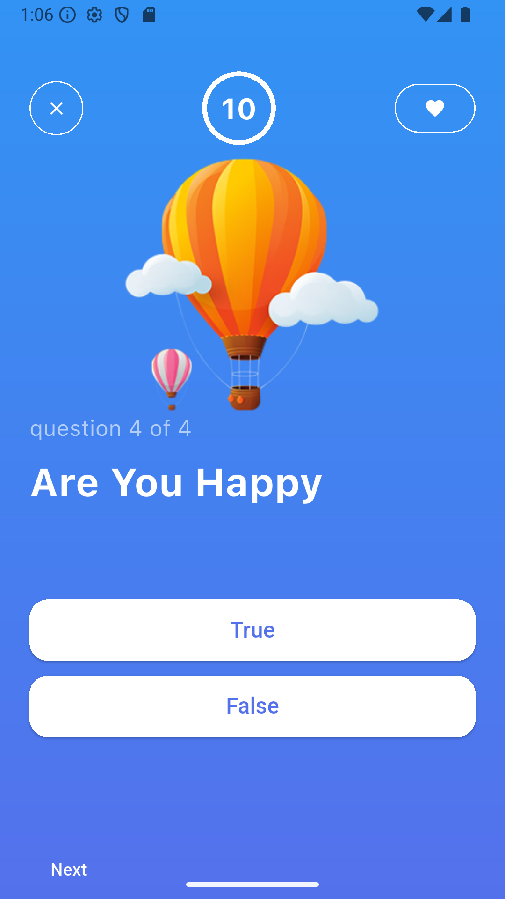
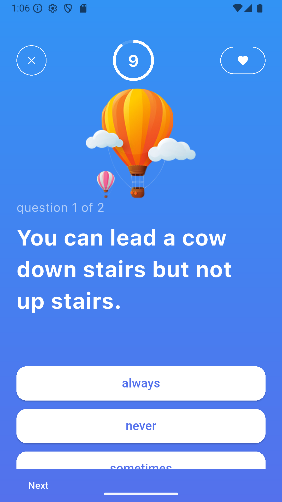
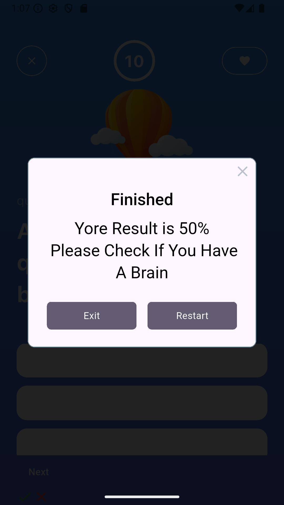

A new Quiz App Project using flutter framework
<h1>🎯 Quiz App</h1>

A Flutter-based mobile application that allows users to take quizzes, test their knowledge, and track their scores. The app features a clean UI, multiple question types, and smooth navigation between questions.

<h2>📱 Features</h2>
<ul>
  <li>🧠 Multiple-choice quizzes</li>
  <li>📊 Real-time score tracking</li>
  <li>🔁 Restart quizzes anytime</li>
  <li>🎨 Beautiful and responsive UI</li>
  <li>💾 Offline functionality (optional)</li>
</ul>

<h2>🚀 Getting Started</h2>

<h3>Prerequisites</h3>
<ul>
  <li>Flutter SDK (>= 3.0.0)</li>
  <li>Android Studio / VS Code</li>
  <li>Dart >= 3.0.0</li>
</ul>

<h3>Installation</h3>
<ol>
  <li>Clone the repository:</li>
  <pre><code>git clone https://github.com/your-username/quiz-app.git
cd quiz-app</code></pre>

  <li>Get the dependencies:</li>
  <pre><code>flutter pub get</code></pre>

  <li>Run the app:</li>
  <pre><code>flutter run</code></pre>
</ol>
<h2>🔧 Technologies Used</h2>
<ul>
  <li>Flutter</li>
  <li>Dart</li>
  <li>Provider / Riverpod (State management)</li>
  <li>Google Fonts</li>
</ul>

<h2>📸 Screenshots</h2>
<table>
  <thead>
    <tr>
      <th>Home Screen</th>
      <th>Quiz Screen</th>
      <th>Result Screen</th>
    </tr>
  </thead>
  <tbody>
    <tr>

  </td>
      <td>  </td>
      <td>   </td>
      <td>   </td>
      <td>     </td>
      
    </tr>
  </tbody>
</table>

<h2>🙌 Contributing</h2>

Pull requests are welcome. For major changes, please open an issue first to discuss what you’d like to change.

<h2>📃 License</h2>

This project is licensed under the MIT License - see the <a href="LICENSE">LICENSE</a> file for details.

